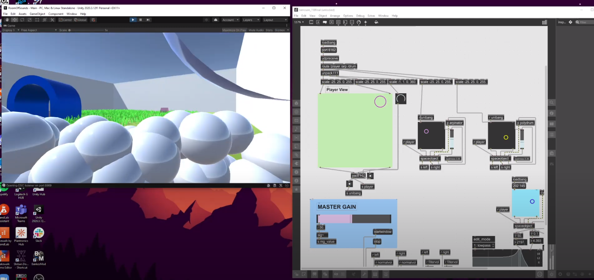

# Room Of Sounds

## About
Room of Sounds is a small Unity-Max/MSP interoperability demo originally created as a final project for Music 158A at Berkeley.

By moving around a room and interacting with objects in Unity, players can change sound characteristics of the objects, including volume, pitch, timbre, and tempo.

**View a short video demo [here](https://www.youtube.com/watch?v=43gY3AVA_BM)!**

## Features
 - **Custom Max/MSP spatial audio engine**: Relative position and rotation of objects to player are calculated in the `spaceobject` subpatch and can be fed into custom sound engines
 - **Position visualization with pictslider**: View the position of the player and all active objects directly from Max

## Object List
 - **Low pass tunnel:** A global low pass filter takes effect when the player moves within a specified radius of the tunnel. Moving closer to the center of the tunnel decreases the cutoff and makes the envelope more pronounced.
 - **Waterfall:** Moving closer to this object applies heavier FM synthesis to distort an ambient water soundtrack.
 - **Arpeggio prism:** Programmable step sequencer that increases in pitch and speed as you get closer to the object
 - **Drum:** Polyrhythmic drum loop that increases in complexity as you get closer to the object

## How it works
This demo uses the [Open Sound Control (OSC)](http://opensoundcontrol.org/) standard to send UDP packets from Unity to Max. On the Unity side, the [UnityOSC](https://github.com/thomasfredericks/UnityOSC) script is used to send data; on the Max side, [odot](https://github.com/CNMAT/CNMAT-odot/) and `udpreceive` handle incoming packets.

Each packet includes the following information:
 - Player position (X, Y)
 - Player rotation (in degrees)
 - Position of every soundobject (X, Y)

Upon receive in Max, the following calculations are processed to determine the relative volume of the sound emitted from each object to each ear:

The results of `left`, `right`, and `vol` are then passed out of the `soundobject` and can be fed into a custom subpatch to alter sound characteristics based on their values.

## Try it yourself!
1. The requirements for running the demo are Unity and Max 8 with the [odot](https://github.com/CNMAT/CNMAT-odot/releases/tag/1.3.0) package.
1. Clone/download the repository.
1. Open up `roomofsounds.maxpat` in the Max editor.
1. In the Max file preferences, include `max_enabled` as an asset path.
1. Adjust the master gain to a reasonable level and start the patch.
1. Open up `Unity/Assets/Scenes/Main.unity` in the Unity editor and start the scene.
1. Use the WASD keys to move the player around. Enjoy!

